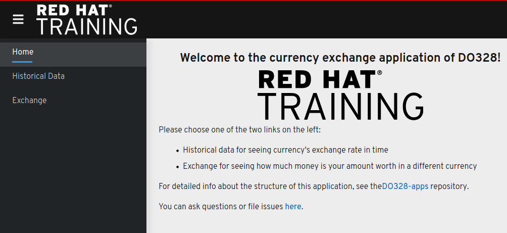

# Currency Exchange application

This application serves as an example of multi-service application. It consists of the following services:

- History
- Currency
- Exchange (Gateway)
- Frontend
- News



## Local Deployment

### Exchange

```sh
mvn quarkus:dev
```

or

```sh
mvn package && java -jar target/exchange-1.0-SNAPSHOT-runner.jar
```

### Frontend

``` sh
npm install
REACT_APP_GW_ENDPOINT="http://localhost:8080" REACT_APP_NEWS_ENABLED=true npm start
```

To verify open browser at localhost:3000

### History

```sh
npm install
PORT=8082 node index.js
```

Validate with `curl -X POST localhost:8082 -d '{"source":"USD","target":"YEN"}' -H "Content-Type: application/json"`.

### News

```sh
pip3 install -r requirements.txt --user
cd src
python3 gossip.py
```

or, if `flask` is installed:

```sh
pip3 install -r requirements.txt --user
FLASK_APP="gossip.py" flask run --host=0.0.0.0 --port 6000
```

### Currency

```sh
mvn quarkus:dev
```

or

```sh
mvn package && java -jar target/currency-1.0-SNAPSHOT-runner.jar
```

## Containerized services

### Keycloak

```sh
podman run \
     -e KEYCLOAK_USER=USERNAME -e KEYCLOAK_PASSWORD=PASSWORD -e JAVA_OPTS_APPEND="-Dkeycloak.profile.feature.upload_script=enabled" \
     -p 8081:8080 \
     -v $(pwd)/quarkus-realm.json:/tmp/quarkus-realm.json:z -e KEYCLOAK_IMPORT=/tmp/quarkus-realm.json \
     --name kc quay.io/keycloak/keycloak:10.0.1
```

Using version 10.0.1 as it is the most advanced version available at this moment without high vulnerabilities and that accepts the upload script format.

### Jaeger

```sh
podman run \
     -p 5775:5775/udp -p 6831:6831/udp -p 6832:6832/udp\
     -p 5778:5778 -p 16686:16686 -p 14268:14268 \
     registry.redhat.io/distributed-tracing/jaeger-all-in-one-rhel8:1.20.1
````
